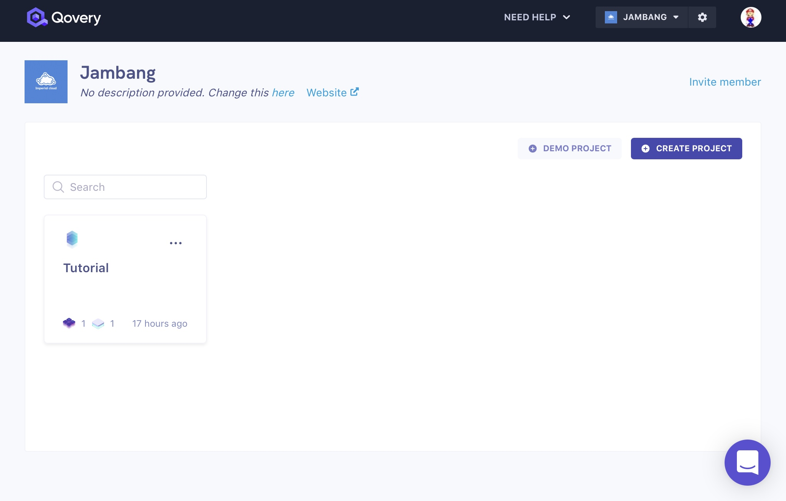
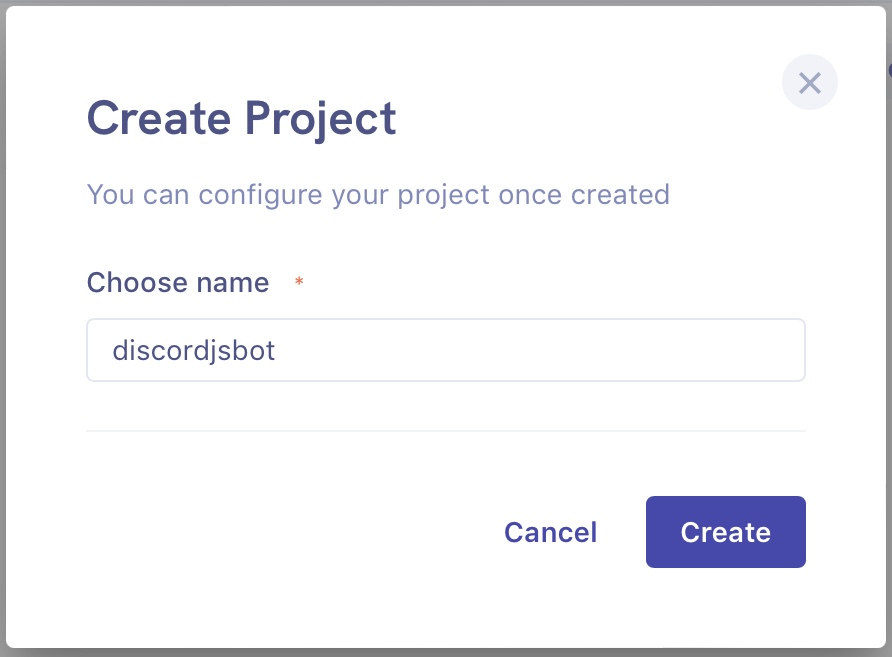
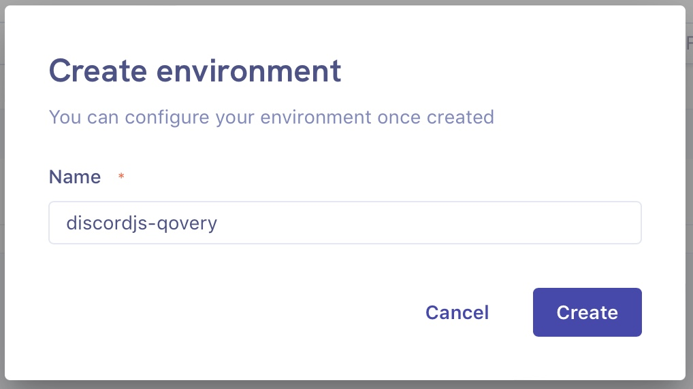
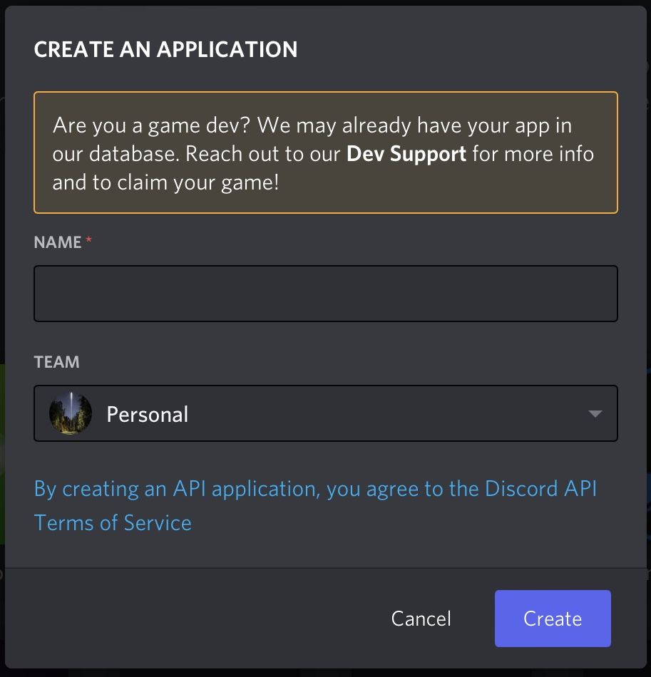
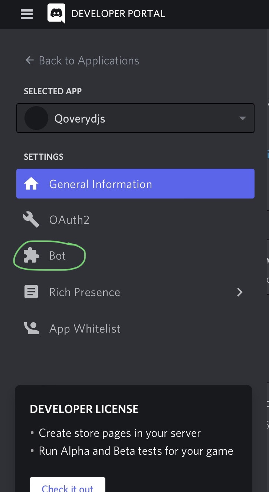
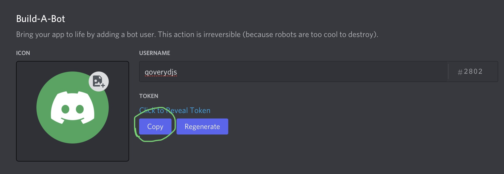
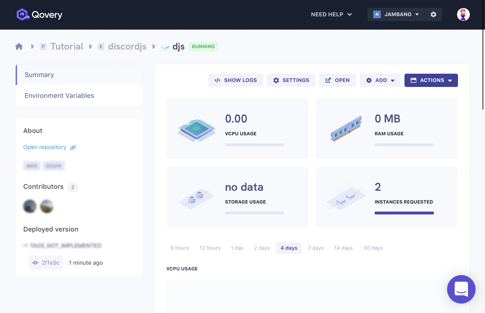
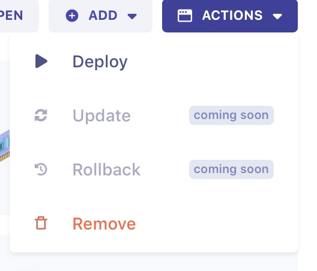
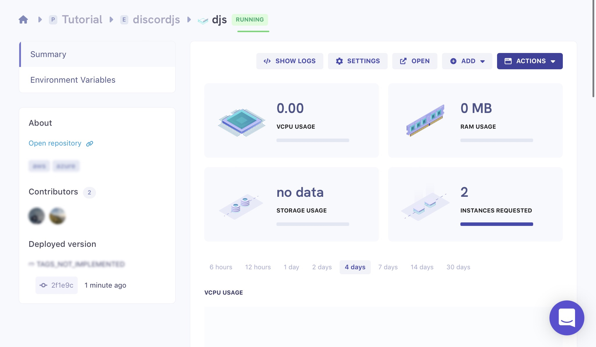

# Deploying simple discord.js bot to Qovery(Web console)

This repository contains tutorial and the total code used in it.

### Prerequisite

-[GitHub](https://github.com) account - will be needed for keeping source code at an place and to be linked in Qovery.

#### Creating a Qovery account

After finising all necessary requirements, you will need to open an account at Qovery.

- Navigate to https://console.qovery.com/login in your desired browser and click on either `Sign in with GitHub` or `Sign in with GitLab` upto you(GitHub recommended). You can create an account at [GitHub](https://github.com/) or [GitLab](https://gitlab.com). In this tutorial we will use GitHub as our application source code is hosted there.

After login & filling some optional forms,this is where you should be:



- Click at the purple button with the `Create a project` text, to create a new **project group**. Name it anything you like and click on `Create`.



Qovery will create a project group for you where you can host multiple applications to keep apps topics organized.

Now let's create a **new environment**. After a project was successfully created you should see this screen:



- Click on `Create environment` and name your environment. For this tutorial, I will name it `discordjs-qovery`. After creation you should see a screen similar to the one below:

**Congratulations! Your Qovery environment is now ready to use 🎉**

#### Now,about the code part.

 We are going to write the actual bot code now to work in `Nodejs`. 

#### The code to make the bot.

The code is written in JavaScript,so for beginners,don't worry,this will be easy,let's get into coding :

You may create index.js file for the bot's main file,where the bot's central functions work.

## Update:
You don't need to use the package.json provided in tutorial,you can clone the repo in your local machine,delete the package.json file which came from this repo,and then run npm init command,and use that package.json generated by node.

First we want to make sure that discord.js package is included in code,so we can interact with discord api to make the bot,and the require classes to make the bot smoothly working.
```js
const { Client, Intents } = require('discord.js');
```
Then,we will want to create an system from where JavaScript will fetch token from other file and send it to index.js,so you will need to add the following code too:

```js
const { token } = require('./config.json');
```

Then,we want to make sure the client is created to be used.

```js
const client = new Client({ intents: [Intents.FLAGS.GUILDS] });
```

We add prefix to bot,else the bot won't respond to commands,we will need to add the following code:

```js
const prefix = "."; // can be edited.
// You can change the prefix to whatever you want,like $,A,7 etc.,
```

Next,we need to see whether the bot is ready to be online without errors,so we add an console.log() code,when the bot is ready without any issues,it will simply use this code,and your bot will have an activity saying "prefix: ." by default,you can change it later on,you will need to add the following code:

```js
client.on("ready", () => {
  console.log(`${client.user.username} Ready to be in qovery`);
  client.user.setActivity("prefix: .");
});
//the console.log() content can we edited too.
```

Then we want to have some clear error message caused by our code,so we add another code to see what's clearly wrong with our code:

```js
client.on("error", console.error);
```

Now,we arrived to our first command,called `ping`:

```js
client.on("message", () => {
  if(message.content === prefix + "ping") {
    message.reply("pong");
  }
});
```

After we done all this,let's leave the coding part temporarily,we need to fetch bot token from discord developer portal,first we will open https://discord.com/developers/applications and login with discord if you didn't,now steps to fetch a bot token:

1.Create a new app,name it whatever you like,but for this tutorial,I will name it Qoverydjs.



2.After creating a new discord app,you will need to create a bot which will be existing in the app,by clicking the button shown below:


After clicking on the bot button,create a new bot,name it as you like.


3.Fetching bot token,after You created a new bot,you must be at this screen:


Then, click on the `copy` button at the screen,so we can save it to use it later.

So,as we got the bot token,next step is,we will go back to code part and create `config.json` file,where our bot token will be stored safely,and put the following code in it,you will need to replace Your_bot_token_here with your actual bot token:

```json
{
 "token" : "Your_bot_token_here",
}
```

Final part of our code is to make our bot code complete, save the config.json file and move to `index.js` file and add this code at the last line:

```js
client.login(token);
//last step of code.
```

Okay,so this is what `index.js` file should be like,by now:

```js
const { Client, Intents } = require('discord.js');
const { token } = require('./config.json');

const client = new Client({ intents: [Intents.FLAGS.GUILDS] });

client.on("ready", () => {
  console.log(`${client.user.username} Ready to be in qovery`);
  client.user.setActivity("prefix: .");
});

client.on("error", console.error);

client.on("message", () => {
  if(message.content === prefix + "ping") {
    message.reply("pong");
  }
});


// Login to Discord with your client's token
client.login(token);
```

and our `config.json` file should be like:

```json
{
 "token" : "bot_token",
}
```
Save the code and move to final process(given below).

Next,we will need to create A file called `Dockerfile` so Qovery can build an container image and deploy our bot,after creating the `Dockerfile` you will need to follow the given steps below:

1.First we need to specify the node version to be used,we will be using Node v14,by adding the follwing code in Dockerfile we can specify the node version:

```Dockerfile
FROM node:14
```
2.As we need bot to be hosted in a fixed directory and make it work directory which will copy all the code and build from there ,we create an mkdir command,we can use the command by specifying it in Dockerfile,we will need to add the follwing code:

```Dockerfile
RUN mkdir -p /usr/src/app2
WORKDIR /usr/src/app2
```

3.We will create an file called `package.json` and add the following code to specify the packages we want to install or in simple words,we tell Dockerfile to fetch dependencies names and install them:

```json
{
  "name": "qovery-discordjs",
  "version": "1.0.0",
  "description": "",
  "main": "index.js",
  "scripts": {
    "start": "node index.js",
    "test": "echo \"Error: no test specified\" && exit 1"
  },
  "repository": {
    "type": "git",
    "url": "git+https://github.com/jiopolm/qovery-discordjs.git"
  },
  "keywords": [],
  "author": "",
  "license": "ISC",
  "bugs": {
    "url": "https://github.com/jiopolm/qovery-discordjs/issues"
  },
  "homepage": "https://github.com/jiopolm/qovery-discordjs/#readme",
  "dependencies": {
    "discord-together": "^1.1.1",
    "discord.js": "~12.2.0",
    "ffmpeg-static": "^4.3.0",
    "fs": "^0.0.2",
    "genius-lyrics": "^4.2.7",
    "ms": "^2.1.3",
    "path": "^0.12.7",
  }
}
```

4.As we created package.json,we can move further and add the following code in Dockerfile from which required packages are installed:

```Dockerfile
COPY package*.json ./
```

5.Now we will need to tell docker to install all the packages from package.json so the dependencies are installed and copied to the directory we made to make the bot work:

```Dockerfile
RUN npm install
COPY . .
```

6.Final Dockerfile part,we will need to execute the index or main file of bot by specifying to docker,in this tutorial we made index.js main file of the bot,so we add the code given below:

```Dockerfile
CMD [ "node", "index.js" ]
```
So,as the Dockerfile part is finished,this is how it should look like:

```Dockerfile
FROM node:16
WORKDIR /app
COPY package*.json ./

RUN npm install
COPY . .

CMD [ "node", "index.js" ]
```


As we finished the Dockerfile part,we will need to tell docker and git to ignore some directories,so the packages are installed based on our app and not based on existing app's code:

(i) We will create `.dockerignore` file to tell docker to ignore some directories,after the creation of `.dockerignore` we will add the follwing code to:

```.dockerignore
node_modules
npm-debug.log
```
(ii) We will create `.gitignore` to specify which directories should be ignore while cloning the repo to somewhere:

```.gitignore
node_modules
```
After saving the two files,we will head back to Qovery web console.


### Deploying to Qovery

Now, that we have got our project and environment ready lets head to [Qovery Console](https://console.qovery.com) and create a new application

Fill out the **_name_** of your application, choose the GitHub repository and the branch and change the **_build mode_** to `Dockerfile` and click on **`Create`** button.

After creation, you should see a screen like this:



From here you will just need to click on the **_Actions_** button and from there select the **_Deploy_** option.



After approximately 4 minutes of waiting,your bot should be deployed successfully on Qovery.



After that,you may check whether the bot is running or not in your server.

**If the bot is responding then Congratulations, you have just deployed your bot to Qovery 🎉**

Thanks for reading :)
